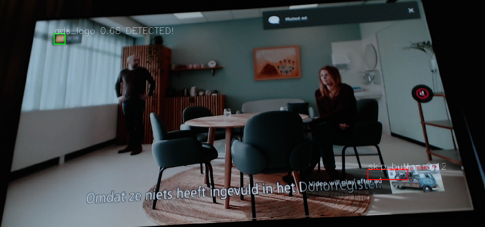

# Ad mute

This project will monitor your TV with a webcam and mute the sound when a Youtube ad is displayed.



## How does it work?

It constantly monitors your tv screen and watches for the tiny ADS icon in the top left of your screen. 

As soon as it appears it will mute the tv so you don't get annoyed by the ads so much. (it really helps :)

It will also press the Skip button when it appears.

It should be fairly easy to modify to use with other TVs or apps as well.

## Requirements

 * Webcam (preferably Logitech C920, i use it as well)
 * LG tv with WebOS, so that we can control volume and press the skip button via the network. 
 * Youtube app

## Installing and configuring

### Install the requirements:
```bash
pip3 install -r requirements.txt
```
Tested on Ubuntu 20.04

### Configure webcam

Look in ./run for an example of the exposure and focus settings.

 * Point your webcam on the screen in a fixed way. Make sure it cant move after you've learned it to recognize ads.
 * Disable auto exposure and auto focus.
 * Make sure to adjust the exposure so the ADS icon is cleary visible and not too bright.
 * It doesnt matter if its a bit out of focus, but its important the focus stays fixed and the white/yellow is visible.
 * Also make sure the Skip button in the lower right is visible.

### Edit config.py

 * Change video device number and maybe resolution. 
 * Default thresholds and settings should be fine.

### Configure TV

 * Start the program with main.py
 * It should scan for your TV and connect to it and pair with it. (Press YES on TV)
 * it might take a minute to find your tv the first time, after that it remembers.

### Teach it where to look

First find and pause an ad:

 * Start watching youtube on your TV until you get an ad.
 * Press pause button
 * press back button once, so the lower bar disappears again.

Teach ad icon location:

 * Draw a square tight around the ADS icon with your mouse.
 * Press 'a' to teach it the "ad icon location"
 * Square should become green and tv should instantly mute.
 * Move your hand in front of the cam to test if it unmutes as well.

Teach skip button location:

 * Keep watching ads until you get a skip button as well.
 * Pause it again and draw the square tight around the skip button
 * Press 's' to teach it the "skip button location"
 * It should immediately skip the ad.

Everything is saved, so as long as you dont move the camera, you dont have to teach it again.

Happy skipping!

### Visual feedback

The color of the square means:
 * Red: Its sure the image is not detected. (similarity is below config.undetect_threshold )
 * Gray: Its not sure
 * Green: Its sure the image is detected (similarity above config.detect_threshold )

If its detected for config.detected_frames frames the it will actually act on it. (And show DETECTED)

Tune the parameters in config.py if needed.
